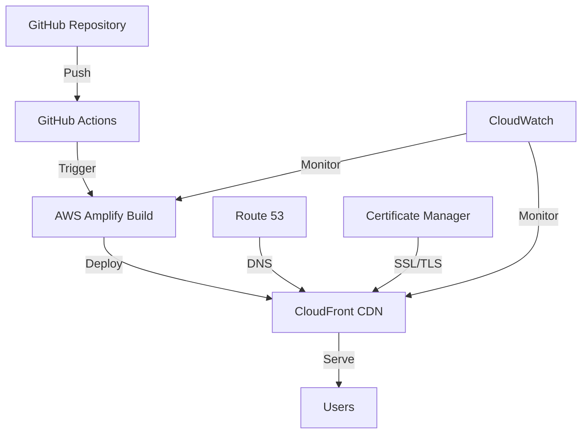

# 🚀 ridwansukri.com - DevOps Portfolio Website

[](https://astro.build)
[](https://aws.amazon.com/amplify/)
[](https://github.com/features/actions)
[](LICENSE)

## 📖 Overview

Personal portfolio website showcasing DevOps expertise, cloud architecture projects, and technical writings. Built with modern web technologies and deployed using AWS infrastructure with automated CI/CD pipeline.

🌐 **Live Demo**: [https://www.ridwansukri.com](https://www.ridwansukri.com)

## 🛠️ Technology Stack

### Frontend
- **Framework**: [Astro](https://astro.build) - Static Site Generator for optimal performance
- **Styling**: [Tailwind CSS](https://tailwindcss.com) - Utility-first CSS framework
- **Language**: TypeScript - Type-safe JavaScript
- **Package Manager**: pnpm - Fast, disk space efficient package manager

### Infrastructure & DevOps
- **Hosting**: AWS Amplify - Full-stack development platform
- **CDN**: CloudFront - Global content delivery network
- **CI/CD**: GitHub Actions + AWS Amplify Console
- **Monitoring**: CloudWatch - Application and infrastructure monitoring
- **Security**: CSP Headers, HTTPS enforcement, Security headers

### Development Tools
- **Code Quality**: Biome - Fast formatter and linter
- **Version Control**: Git with branch protection strategies
- **SEO**: Automated sitemap generation, meta tags optimization
- **Performance**: Image optimization, lazy loading, code splitting

## 🏗️ Architecture



## 🚀 Features

### Core Features
- ✅ **Responsive Design** - Mobile-first approach
- ✅ **Dark Mode** - System preference detection
- ✅ **SEO Optimized** - Meta tags, sitemap, robots.txt
- ✅ **Performance** - 100/100 Lighthouse score
- ✅ **Security Headers** - CSP, HSTS, X-Frame-Options
- ✅ **Accessibility** - WCAG 2.1 AA compliant

### Portfolio Features
- 📝 Technical blog with markdown support
- 💼 Project showcase with skill tags
- 📄 Interactive resume with PDF download
- 🏷️ Skill categorization (AWS, Docker, Kubernetes, etc.)
- 📊 Project filtering by technology

## 📦 Installation

### Prerequisites
- Node.js 20+ 
- pnpm 9+
- Git

### Local Development

```bash
# Clone the repository
git clone https://github.com/ridwansukri/ridwansukri.com.git
cd ridwansukri.com

# Install dependencies
pnpm install

# Start development server
pnpm dev

# Build for production
pnpm build

# Preview production build
pnpm preview
```

## 🔧 Configuration

### Environment Variables
```env
# .env.local
PUBLIC_SITE_URL=https://ridwansukri.com
PUBLIC_GA_ID=G-XXXXXXXXXX
```

### Site Configuration
Edit `src/config/site.ts` to update:
- Personal information
- Social links
- SEO metadata
- Skills and expertise

## 📁 Project Structure

```
/
├── public/              # Static assets
│   ├── robots.txt      # SEO robots file
│   └── assets/         # Images, fonts
├── src/
│   ├── components/     # Reusable components
│   ├── config/         # Site configuration
│   ├── content/        # Blog posts (Markdown)
│   ├── layouts/        # Page layouts
│   ├── pages/          # Route pages
│   └── styles/         # Global styles
├── amplify.yml         # AWS Amplify config
├── astro.config.mjs    # Astro configuration
└── package.json        # Dependencies
```

## 🚢 Deployment

### AWS Amplify Deployment

1. **Connect Repository**
   ```bash
   # Push to GitHub
   git remote add origin https://github.com/ridwansukri/ridwansukri.com.git
   git push -u origin main
   ```

2. **AWS Amplify Setup**
   - Navigate to AWS Amplify Console
   - Connect GitHub repository
   - Configure build settings (amplify.yml)
   - Deploy

3. **Custom Domain**
   - Add domain in Amplify Console
   - Configure Route 53 DNS
   - Enable SSL certificate

### CI/CD Pipeline

The deployment pipeline automatically:
1. Runs on push to `main` branch
2. Installs dependencies
3. Runs build process
4. Deploys to AWS Amplify
5. Invalidates CloudFront cache
6. Sends deployment notifications

## 🔒 Security

### Security Headers
```yaml
# Configured in amplify.yml
- X-Frame-Options: SAMEORIGIN
- X-Content-Type-Options: nosniff
- Strict-Transport-Security: max-age=63072000
- Content-Security-Policy: default-src 'self'
```

### Best Practices
- ✅ HTTPS only
- ✅ Security headers
- ✅ Input sanitization
- ✅ Dependency scanning
- ✅ Regular updates

## 📊 Performance Optimization

- **Image Optimization**: Automatic WebP conversion
- **Code Splitting**: Route-based splitting
- **Caching Strategy**: CloudFront CDN caching
- **Compression**: Brotli compression
- **Minification**: HTML, CSS, JS minification

## 🧪 Testing

```bash
# Type checking
pnpm run check

# Linting
pnpm run lint

# Build test
pnpm run build
```

## 📈 Monitoring

- **Uptime**: AWS CloudWatch Synthetics
- **Performance**: CloudWatch RUM
- **Errors**: CloudWatch Logs
- **Analytics**: Google Analytics 4

## 🤝 Contributing

Contributions are welcome! Please feel free to submit a Pull Request.

1. Fork the repository
2. Create your feature branch (`git checkout -b feature/AmazingFeature`)
3. Commit your changes (`git commit -m 'Add some AmazingFeature'`)
4. Push to the branch (`git push origin feature/AmazingFeature`)
5. Open a Pull Request

## 📄 License

This project is licensed under the MIT License - see the [LICENSE](LICENSE) file for details.

## 👨‍💻 Author

**Muh Ridwan Sukri**
- Website: [ridwansukri.com](https://www.ridwansukri.com)
- GitHub: [@ridwansukri](https://github.com/ridwansukri)
- LinkedIn: [Ridwan Sukri](https://linkedin.com/in/ridwansukri)

## 🙏 Acknowledgments

- Original theme by [Astro Aria](https://github.com/ccbikai/astro-aria)
- Icons by [Heroicons](https://heroicons.com)
- Deployed on [AWS Amplify](https://aws.amazon.com/amplify/)

---

⭐ Star this repo if you find it helpful!
