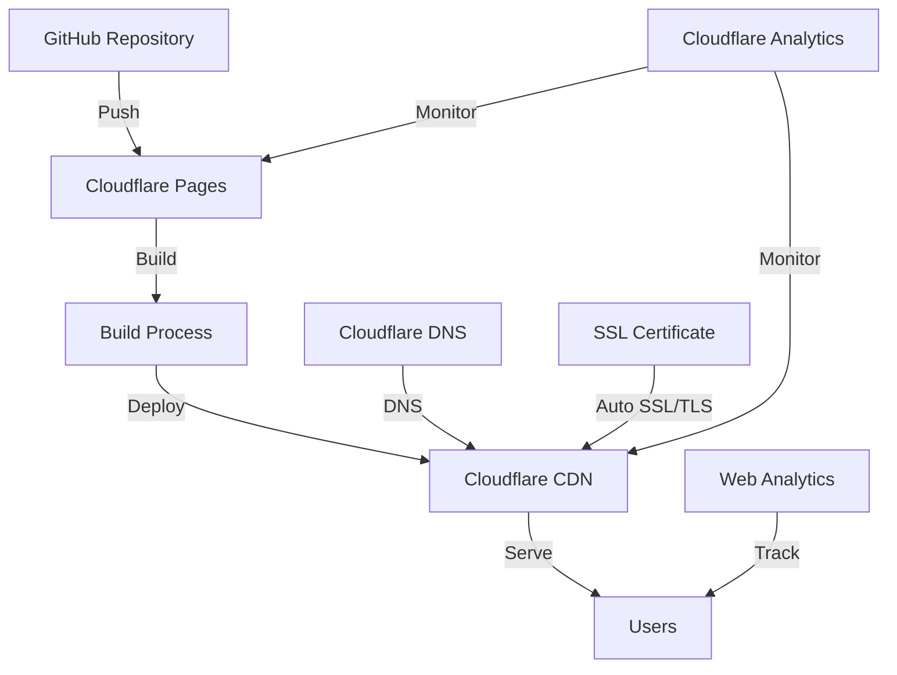

# 🚀 ridwansukri.com - DevOps Portfolio Website

[](https://astro.build)
[](https://pages.cloudflare.com/)
[](https://github.com/features/actions)
[](LICENSE)

## 📖 Overview

Personal portfolio website showcasing DevOps expertise, cloud architecture projects, and technical writings. Built with modern web technologies and deployed using Cloudflare Pages with automated CI/CD pipeline.

🌐 **Live Demo**: [https://www.ridwansukri.com](https://www.ridwansukri.com)

## 🛠️ Technology Stack

### Frontend
- **Framework**: [Astro](https://astro.build) - Static Site Generator for optimal performance
- **Styling**: [Tailwind CSS](https://tailwindcss.com) - Utility-first CSS framework
- **Language**: TypeScript - Type-safe JavaScript
- **Package Manager**: pnpm - Fast, disk space efficient package manager

### Infrastructure & DevOps
- **Hosting**: Cloudflare Pages - Fast, secure static site hosting
- **CDN**: Cloudflare CDN - Global content delivery network
- **CI/CD**: GitHub Integration + Cloudflare Pages automatic deployment
- **Monitoring**: Cloudflare Analytics - Web analytics and performance monitoring
- **Security**: CSP Headers, HTTPS enforcement, DDoS protection, Security headers

### Development Tools
- **Code Quality**: Biome - Fast formatter and linter
- **Version Control**: Git with branch protection strategies
- **SEO**: Automated sitemap generation, meta tags optimization
- **Performance**: Image optimization, lazy loading, code splitting

## 🏗️ Architecture



## 🚀 Features

### Core Features
- ✅ **Responsive Design** - Mobile-first approach
- ✅ **Dark Mode** - System preference detection
- ✅ **SEO Optimized** - Meta tags, sitemap, robots.txt
- ✅ **Performance** - 100/100 Lighthouse score
- ✅ **Security Headers** - CSP, HSTS, X-Frame-Options
- ✅ **Accessibility** - WCAG 2.1 AA compliant

### Portfolio Features
- 📝 Technical blog with markdown support
- 💼 Project showcase with skill tags
- 📄 Interactive resume with PDF download
- 🏷️ Skill categorization (AWS, Cloudflare, Docker, Kubernetes, etc.)
- 📊 Project filtering by technology

## 📦 Installation

### Prerequisites
- Node.js 20+ 
- pnpm 9+
- Git

### Local Development

```bash
# Clone the repository
git clone https://github.com/ridwansukri/ridwansukri.com.git
cd ridwansukri.com

# Install dependencies
pnpm install

# Start development server
pnpm dev

# Build for production
pnpm build

# Preview production build
pnpm preview
```

## 🔧 Configuration

### Environment Variables
```env
# Github Action Secrets
CLOUDFLARE_ACCOUNT_ID
CLOUDFLARE_API_TOKEN
```

### Site Configuration
Edit `src/config/site.ts` to update:
- Personal information
- Social links
- SEO metadata
- Skills and expertise

## 📁 Project Structure

```
/
├── public/              # Static assets
│   ├── robots.txt      # SEO robots file
│   ├── _headers        # Cloudflare security headers
│   ├── _redirects      # Cloudflare redirects
│   └── assets/         # Images, fonts
├── src/
│   ├── components/     # Reusable components
│   ├── config/         # Site configuration
│   ├── content/        # Blog posts (Markdown)
│   ├── layouts/        # Page layouts
│   ├── pages/          # Route pages
│   └── styles/         # Global styles
├── wrangler.toml       # Cloudflare config (optional)
├── astro.config.mjs    # Astro configuration
└── package.json        # Dependencies
```

## 🚢 Deployment

### Cloudflare Pages Deployment

1. **Connect Repository**
   ```bash
   # Push to GitHub
   git remote add origin https://github.com/ridwansukri/ridwansukri.com.git
   git push -u origin main
   ```

2. **Cloudflare Pages Setup**
   - Login to [Cloudflare Dashboard](https://dash.cloudflare.com/)
   - Choose "Workers & Pages" from sidebar
   - Click "Create application" → "Pages" → "Connect to Git"
   - Authorize GitHub and choose repository
   - Configure build settings:
     - Framework preset: `Astro`
     - Build command: `pnpm build`
     - Build output directory: `dist`
     - Node version: `20`
   - Deploy

3. **Custom Domain**
   - On Cloudflare Pages dashboard, choose project
   - Tab "Custom domains" → "Set up a custom domain"
   - Enter `www.ridwansukri.com` and `ridwansukri.com`
   - DNS and SSL will be configured automatically.

### CI/CD Pipeline

The deployment pipeline automatically:
1. Runs on push to `main` branch
2. Triggers Cloudflare Pages build
3. Installs dependencies with pnpm
4. Runs build process (Astro)
5. Deploys to Cloudflare global network
6. Purges cache automatically
7. Preview deployments for other branches

## 🔒 Security

### Security Headers
```yaml
# Configured in public/_headers
- X-Frame-Options: SAMEORIGIN
- X-Content-Type-Options: nosniff
- Strict-Transport-Security: max-age=63072000
- Content-Security-Policy: default-src 'self'
- Permissions-Policy: camera=(), microphone=()
```

### Best Practices
- ✅ HTTPS only
- ✅ Security headers
- ✅ Input sanitization
- ✅ Dependency scanning
- ✅ Regular updates

## 📊 Performance Optimization

- **Image Optimization**: Automatic WebP conversion with Cloudflare Polish (optional)
- **Code Splitting**: Route-based splitting
- **Caching Strategy**: Cloudflare CDN with smart caching
- **Compression**: Automatic Brotli/Gzip compression
- **Minification**: HTML, CSS, JS minification
- **Auto Minify**: Cloudflare Auto Minify for HTML, CSS, JS

## 🧪 Testing

```bash
# Type checking
pnpm run check

# Linting
pnpm run lint

# Build test
pnpm run build
```

## 📈 Monitoring

- **Uptime**: Cloudflare Analytics
- **Performance**: Web Analytics & Core Web Vitals
- **Errors**: Cloudflare Logs (Enterprise) or Pages Functions Logs
- **Analytics**: Google Analytics 4 + Cloudflare Web Analytics
- **Security**: Cloudflare Security Analytics

## 🤝 Contributing

Contributions are welcome! Please feel free to submit a Pull Request.

1. Fork the repository
2. Create your feature branch (`git checkout -b feature/AmazingFeature`)
3. Commit your changes (`git commit -m 'Add some AmazingFeature'`)
4. Push to the branch (`git push origin feature/AmazingFeature`)
5. Open a Pull Request

## 📄 License

This project is licensed under the MIT License - see the [LICENSE](LICENSE) file for details.

## 👨‍💻 Author

**Muh Ridwan Sukri**
- Website: [www.ridwansukri.com](https://www.ridwansukri.com)
- GitHub: [@ridwansukri](https://github.com/ridwansukri)
- LinkedIn: [Muh Ridwan Sukri](https://linkedin.com/in/ridwansukri)

## 🙏 Acknowledgments

- Original theme by [Astro Aria](https://github.com/ccbikai/astro-aria)
- Icons by [Heroicons](https://heroicons.com)
- Deployed on [Cloudflare Pages](https://pages.cloudflare.com/)

---

⭐ Star this repo if you find it helpful!
